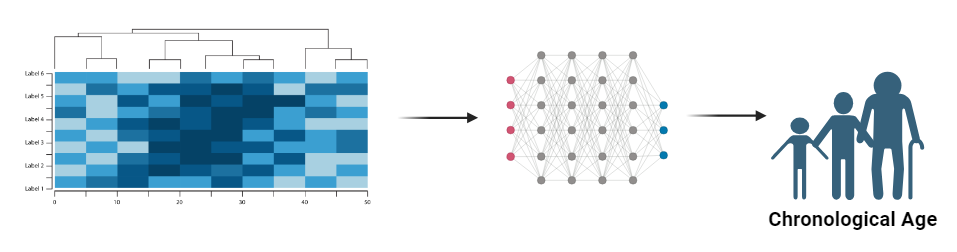

<h1 align='center'>Predicting Age Through Plasma Protein Composition</h1>

## Table of Contents:
1. [Scientific Background](#1)
2. [Project Summary](#2)
3. [Instructions to Use Predictor App](#3)
4. [Additional Information](#3)

<h2 align='center'>Scientific Background</h1>

Inflammaging is defined as an age-related increase in levels of pro-inflammatory markers in the blood and tissues, and is a strong risk factor for many disease that are highly prevalent in the older population. This process is a "chronic, sterile, low-grade inflammation that contributes to the pathogenesis of age-related diseases". Although there is no specific way to reduce inflammaging, changing one's way of life (ie. exercising, healthy diet) can be highly important to obtaining a minimal inflammaging phenotype. A healthy diet can be especially crucial due to the central role of the gut microbiota in both metaflammation (metabolic inflammation) and inflammaging. In order to study how inflammaging can be minimized or even prevented, it is crucial to parse out information obtained from various tissues and plasma. Here I will be looking at plasma proteins, specifically the inflammatory cytokines, to create a model that will be able to predict the age of the subject.

	

### References
1. Lind, L., Sundström, J., Larsson, A., Lampa, E., Ärnlöv, J., & Ingelsson, E. (2019). Longitudinal effects of aging on plasma proteins levels in older adults - associations with kidney function and hemoglobin levels. PloS one, 14(2), e0212060: <a href='https://www.ncbi.nlm.nih.gov/pmc/articles/PMC6388926/'>PLoS One</a>
2. Toshiko Tanaka, Nathan Basisty, Giovanna Fantoni, Julián Candia, Ann Z Moore, Angelique Biancotto, Birgit Schilling, Stefania Bandinelli, Luigi Ferrucci (2020) Plasma proteomic biomarker signature of age predicts health and life span eLife 9:e61073: <a href='https://elifesciences.org/articles/61073'>eLife</a>
3. Franceschi, C., Garagnani, P., Parini, P. et al. Inflammaging: a new immune–metabolic viewpoint for age-related diseases. Nat Rev Endocrinol 14, 576–590 (2018). <a href='https://www.nature.com/articles/s41574-018-0059-4'>Nature</a>

<h2 align='center'>Project Summary</h1>

### Goal:
There is a higher risk for older patients for many chronic diseases and in order to curate treatments and therapies, it is essential to identify important genes and protein biomarkers that causes this phenotype. For example, it is well known that certain proteins like C-reactive protein and certain growth-differentiation factors are increased with aging (<a href='https://www.ncbi.nlm.nih.gov/pmc/articles/PMC6388926/'>link</a>) Here, I will be using past data from plasma protein composition dataset and age of animals to predict how protein changes with aging, and therefore be able to predict the 'age' of the subject. The Diagram (diagram created with biorender) below shows the overall goal of the project: using protein composition data and feed it into a machine learning model to predict the age number that is associated with that protein pattern. 

### Metrics:
I will be testing the data against a classification and regression estimator (supervised learning) and seeing which are the more suitable model for this experiment. 

The models that I will be testing for classification are:
1. LogisticRegression
2. RandomForestClassification
3. SVC
4. XGBoostClassifier

The models that I will be testing for regression are:
1. SVR
2. RandomForestRegressor
3. LinearRegression
4. KNN
5. XGBoostRegressor

### Data Used

Compilation of past experimental data looking at plasma protein composition in various models of neurodegeneration and aging.

*Here I have parsed out only the relevant features per projecs*

**Table 1. Features**

### Table of Contents
1. Data Cleaning and Wrangling
2. Exploring Data
3. Clustering Analysis
* 3.1 KMeans
* 3.2 PCA Analysis

4. Modeling: Predicting Age
* 4.1 Classification
* 4.2 Regression
5. Summary
    
### Next Steps:
1. Use the LDA analysis method but on a dataset where the ages have not been reduced to two classes 

### Deployed:
Currently a working model is deployed using HuggingFace Gradio framework. *password input necessary** <a href='https://huggingface.co/spaces/johnnys7n/predicting_age_with_plasma_proteins'>Spaces Link</a>

### NOTE:
The data used will not be made available until permission from the company. 

<h2 align='center'>Instructions to Use Predictor App</h1>

### Gradio.app
For this project, I specifically used the Gradio an open-source Python Library for easy deployment of my machine learning model. 

**Requirements:**
Please install gradio using `pip`:
> `pip install gradio`

Here is a <a href='https://www.gradio.app/guides/quickstart'>link</a> for more information! 

<h2 align='center'>Additional Information</h1>

1. The `Initial Analysis` folder (<a href='https://github.com/johnnys7n/Predictive-Protein-Analysis/tree/main/Initial Analysis'>at this link</a>) contains a jupyter notebook of the first rendention of the unsupervised algorithm methodology used for clustering analysis to validate model effects. This has helped build the foundation for developing a protocol to analyze high dimensional plasma protein data, and was used for the age_predictor analysis as well. Some things to note:
   * Instead of standardization, I opted for the normalization of data using `MinMaxScaler()` since a "negative" concentration of proteins do not exist in the plasma. In order to keep the values reflective of the natural setting, while keeping the scale of the features similar, normalization was used. 
   * Currently, I am using a fewer dimensions dataset of 10-20 dimensions with ~50-70 observations, which is why I have chosen to use KMeans ('k-means++' for initialization of centroids) for the preliminary analysis, however for the actual human plasma protein data of >10,000 dimensions, KMeans will not be the optimal model since the Euclidean distance often fails at this scale, "curse of dimensionality" (unless dimensionality reduction is used for compensation). For the future, I will look at other clustering algorithms, such as hierarchical method with HDBSCAN. 
   * So far, I have used principal component analysis for dimensionality reduction (checking the data loss using cumulative variance) and visualized by setting `n_components = 2`. However, it might even be a good idea to set the `n_components = 3` and visualize it in 3-D using the `mpl_toolkits.mplot3d.axes3d`. For the next steps, I will see if other dimensionality reduction techniques such as UMAP, tSNE, especially for higher dimensional data.

2. The `relevant_data_example_modeling` folder (<a href="https://github.com/johnnys7n/Predictive-Protein-Analysis/tree/main/relevant_data_example_modeling">at this link</a>) contains a .ipynb file of a quick project I did for predicting gliomas using data from UCI Machine Learning Repository. Instead of protein expression however, I wanted to see if the same concept would apply to genetic expression. Since expressed genes do not necessary correlate with increased protein levels due to post-translational modifications. 
  

Example image of brain gliomas: <a href='https://ysph.yale.edu/news-article/yale-biostatistics-researcher-awarded-dollar13-million-grant-to-study-glioma-brain-tumors/'>link</a>

	

### Project Information: Predicting Gliomas

Here I look at three different classifiers:
1. LogisticRegression
2. KNeighborsClassifier
3. RandomForestClassifier

#### Conclusion:
Out of these three models, the best model was the LogisticRegression with a hypertuned recall score of `93.67%`.

**Next Steps**
For the next round of investigation, I will look at these models below as well:
1. ElasticNet
2. NaiveBayes
3. SVC
4. XGBoost
  

Next in the <a href="https://github.com/johnnys7n/Predictive-Protein-Analysis/tree/main/Utils">Utils directory</a> I created a processing tools script that contains useful functions for automating visualizations.

